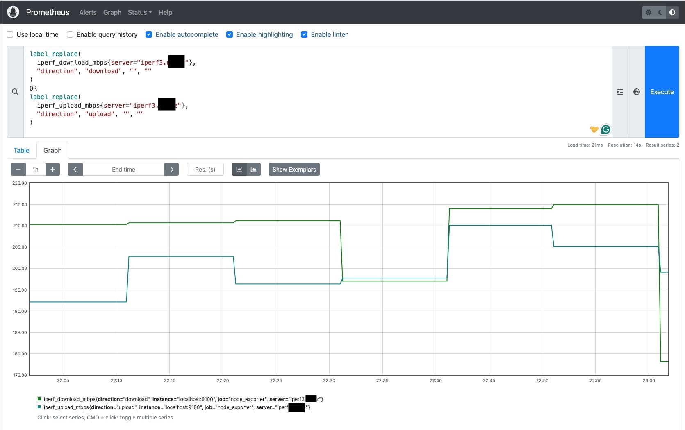

# Internet Bandwidth Monitoring Solution (iperf3_bandwidth_exporter)
The intention of this solution is to use iperf3 for Internet bandwidth monitoring and creating node_exporter file usable by Prometheus for longer data retention and visualization.

The monitoring script requires
* sh - Bourne Shell - default shell in FreeBSD
* iperf3 - perform network throughput tests
* jq - Command-line JSON processor
* bc - arbitrary-precision decimal arithmetic language and calculator - default software in FreeBSD

The monitoring script generates iperf3 metrics into file __*/var/db/node_exporter/iperf3.prom*__

## iperf3 Monitoring Script

The script was developed and tested on FreeBSD

### Installation

In this section we cover the installation of iperf3_bandwidth_exporter script on FreeBSD.

```bash
pkg install iperf3 jq
```

Fetch the bandwidth monitoring script, make it executable and copy it to production location 

```bash
fetch https://raw.githubusercontent.com/davidpasek/iperf3_bandwidth_exporter/refs/heads/main/iperf3_bandwidth_exporter.sh
chown root:wheel ./iperf3_bandwidth_exporter.sh
# CHANGE IPERF3 SERVERS IN THE SCRIPT - Use one or more iperf3 servers separated by spaces
# SERVERS="iperf3-a.example.com iperf3-b.example.com iperf3-c.example.com"
chmod 755 ./iperf3_bandwidth_exporter.sh
cp ./iperf3_bandwidth_exporter.sh /usr/local/bin/iperf3_bandwidth_exporter.sh
```

### Verify script works as expected

```bash
/usr/local/bin/iperf3_bandwidth_exporter.sh
cat /var/db/node_exporter/iperf3.prom
```

### Setup cron entry

```bash
cat <<EOF > /etc/cron.d/iperf3_bandwidth_exporter
*/10 * * * * root /usr/local/bin/iperf3_bandwidth_exporter.sh
EOF

chmod 644 /etc/cron.d/iperf3_bandwidth_exporter
```

### Verify cron task is working

```bash
tail -f /var/log/cron
```
Wait at least 10 minutes and you should see something like ...

```text
Jan  4 19:20:00 freebsd01 /usr/sbin/cron[12141]: (root) CMD (/usr/local/bin/iperf3_bandwidth_exporter.sh)
```

## Using Node Exporter to expose iperf3 data

### Node Exporter installation

```bash
pkg install node_exporter
```

### Enable and start Node Exporter

```bash
sysrc node_exporter_enable="YES"
sysrc node_exporter_listen_address=":9100"
sysrc node_exporter_textfile_dir="/var/db/node_exporter"
service node_exporter start
```

### Verify Node Exporter is working

Get web page at __*http://[IP-ADDRESS-OF-YOUR-NODE]:9100/metrics*__ and you should see something like ...

```text
# HELP iperf_download_mbps iperf3 download throughput
# TYPE iperf_download_mbps gauge
iperf_download_mbps{server="iperf3.example.com"} 138.82734053767794
# HELP iperf_retransmits_download iperf3 TCP retransmits (download)
# TYPE iperf_retransmits_download gauge
iperf_retransmits_download{server="iperf3.example.com"} 58
# HELP iperf_retransmits_upload iperf3 TCP retransmits (upload)
# TYPE iperf_retransmits_upload gauge
iperf_retransmits_upload{server="iperf3.example.com"} 0
# HELP iperf_up iperf3 measurement success (1=ok, 0=error)
# TYPE iperf_up gauge
iperf_up{server="iperf3.example.com"} 1
# HELP iperf_upload_mbps iperf3 upload throughput
# TYPE iperf_upload_mbps gauge
iperf_upload_mbps{server="iperf3.example.com"} 192.61248497752766
```

## Using Prometheus to store monitoring data

### Prometheus installation

```bash
pkg install prometheus
```

### Configure and start Prometheus

```bash
sysrc prometheus_enable="YES"
sysrc prometheus_args="--storage.tsdb.retention.time=30d" # 30 days data retention
service prometheus start
```

Default Prometheus configuration on FreeBSD is available at __*/usr/local/etc/prometheus.yml*__ and it monitors only itself.

You should use Prometheus configuration __*prometheus.yml*__ available in this repository. It is full Prometheus configuration. 

```bash
fetch https://raw.githubusercontent.com/davidpasek/iperf3_bandwidth_exporter/refs/heads/main/prometheus/prometheus.yml
chown root:wheel ./prometheus.yml
cp ./prometheus.yml  /usr/local/etc/prometheus.yml
```

The only section added to the default configuration is the scraping of local node_exporter. Such section (Prometheus configuration sippet) is documented below ...

```yaml
  - job_name: "node_exporter"
    static_configs:
      - targets: ["localhost:9100"]
```

### Verify Prometheus is working

Get web page from __*http://[IP-ADDRESS-OF-YOUR-NODE]]:9090/-/healthy*__ and you should see message ...

```text
Prometheus Server is Healthy.
```

### Using Prometheus to visualize historical data

Go to Prometheus web interface at __*http://[IP-ADDRESS-OF-YOUR-NODE]]:9090/*__ 

You can use folowing PromQL for graphing (time series) ...

```test
iperf_download_mbps{server="iperf3.example.com"}
iperf_upload_mbps{server="iperf3.example.com"}

avg_over_time(iperf_download_mbps{server="iperf3.example.com"}[30m])
avg_over_time(iperf_upload_mbps{server="iperf3.example.com"}[30m])

avg_over_time(iperf_download_mbps{server="iperf3.example.com"}[1h])
avg_over_time(iperf_upload_mbps{server="iperf3.example.com"}[1h])
```

If you want add two time series (download and upload) into a single graph, you can do it by following PromQL ...

```text
label_replace(
  iperf_download_mbps{server="iperf3.uw.cz"},
  "direction", "download", "", ""
)
OR
label_replace(
  iperf_upload_mbps{server="iperf3.uw.cz"},
  "direction", "upload", "", ""
)
```

Screenshot of above PromQL visualization is depicted below.


